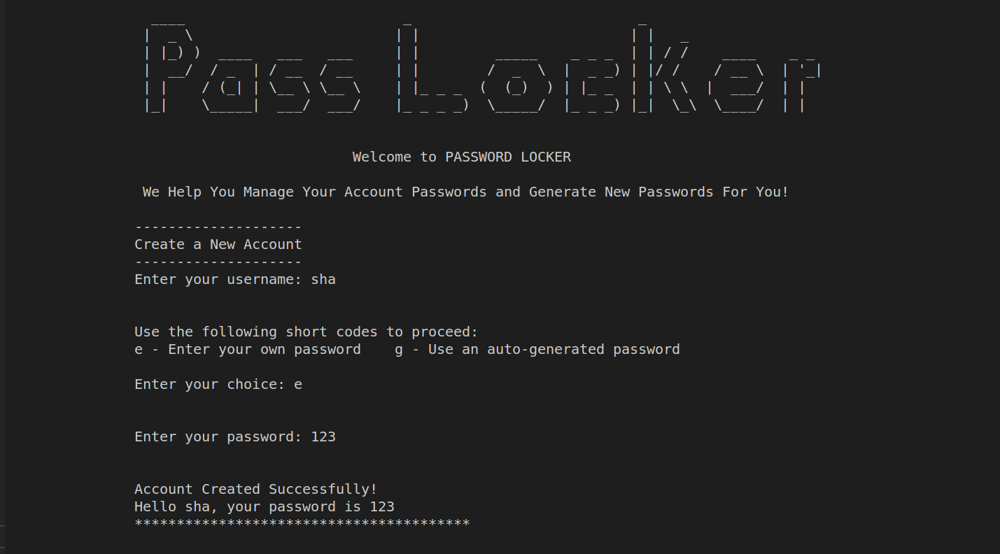

# Password-Locker

## Project Description
On Average, a person has at least 7 different accounts he or she has signed in to, be it email, social media, entertainment or job portal accounts among others. It therefore becomes quite tasking for a user to remember all these passwords. This project handles this challenge by helping users
manage the passwords of their various accounts and also generates new passwords for them when creating new accounts.

## Author
- [Shalyne Waweru](https://github.com/Shalyne-Waweru)
- Email: shalynewaweru@gmail.com

## Installation Requirements
The application requires the following installations to operate
- python3.6
- pip

## Project setup instructions
To start using this project use the following commands:

- `git clone https://github.com/Shalyne-Waweru/Password-Locker.git`
- `cd Password-Locker`

Run the following commands on the terminal
-  $ `chmod +x run.py`
-  $ `./run.py`

## Technologies Used
- Python

## Behaviour Driven Development

|   Behaviour       	      |  Input             	    |  Output      	|
|   :---: 	                |  :---:	                |  :---:	          |
|   Open the application on the terminal  	| Run the commannd  `$ ./run.py`	| Welcome to PASSWORD LOCKER. We Help You Manage Your Account Passwords and Generate New Passwords For You!  	|
|   Create a New Account    |   Enter `username` and `password`. Type `e` to enter your own password or `g` to have a password generated for you	|   Account Created Successfully! Hello `username`, your password is `password`	|
|   Login to your account | Enter `username` and `password` |  IF USER EXISTS -> Hello `username`.Welcome To PassWord Locker IF THE WRONG PASSWORD WAS ENTERED -> Invalid password. Please try Again IF USER DOESN'T EXIST -> That user does not exist| 
|   Create New Account Credentials |  Enter `cr` then enter username and password. Type `e` to enter your own password or `g` to have a password generated for you | New Account Credential Created Successfully! Account Name: `accountType`  Username: `username`  Password: `password` |
|   Store Existing Account Credentials  |  Enter username and password  | Existing Account Credentials Stored Successfully! Account Name: `accountType`  Username: `username`  Password: `password`  |
|   Display All Account Credentials | Enter `dis` | IF DETAILS EXISTS -> Here's a list of all you account credentials  IF DETAILS DON'T EXISTS -> You Don't have any existing account credentials. Login to create a new account or store your existing accounts |
|   Delete Account Credentials | Enter `del` and the account name you want to delete | Account Credentials Deleted Successfully! |
|   Exit the application | Enter `ex`| Thank you for Using Password Locker|

## License info
MIT License

Copyright (c) 2022 Shalyne Waweru

Permission is hereby granted, free of charge, to any person obtaining a copy
of this software and associated documentation files (the "Software"), to deal
in the Software without restriction, including without limitation the rights
to use, copy, modify, merge, publish, distribute, sublicense, and/or sell
copies of the Software, and to permit persons to whom the Software is
furnished to do so, subject to the following conditions:

The above copyright notice and this permission notice shall be included in all
copies or substantial portions of the Software.

THE SOFTWARE IS PROVIDED "AS IS", WITHOUT WARRANTY OF ANY KIND, EXPRESS OR
IMPLIED, INCLUDING BUT NOT LIMITED TO THE WARRANTIES OF MERCHANTABILITY,
FITNESS FOR A PARTICULAR PURPOSE AND NONINFRINGEMENT. IN NO EVENT SHALL THE
AUTHORS OR COPYRIGHT HOLDERS BE LIABLE FOR ANY CLAIM, DAMAGES OR OTHER
LIABILITY, WHETHER IN AN ACTION OF CONTRACT, TORT OR OTHERWISE, ARISING FROM,
OUT OF OR IN CONNECTION WITH THE SOFTWARE OR THE USE OR OTHER DEALINGS IN THE
SOFTWARE.
